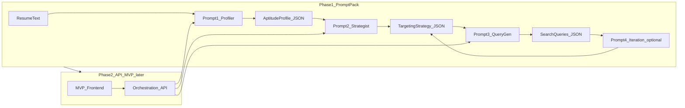
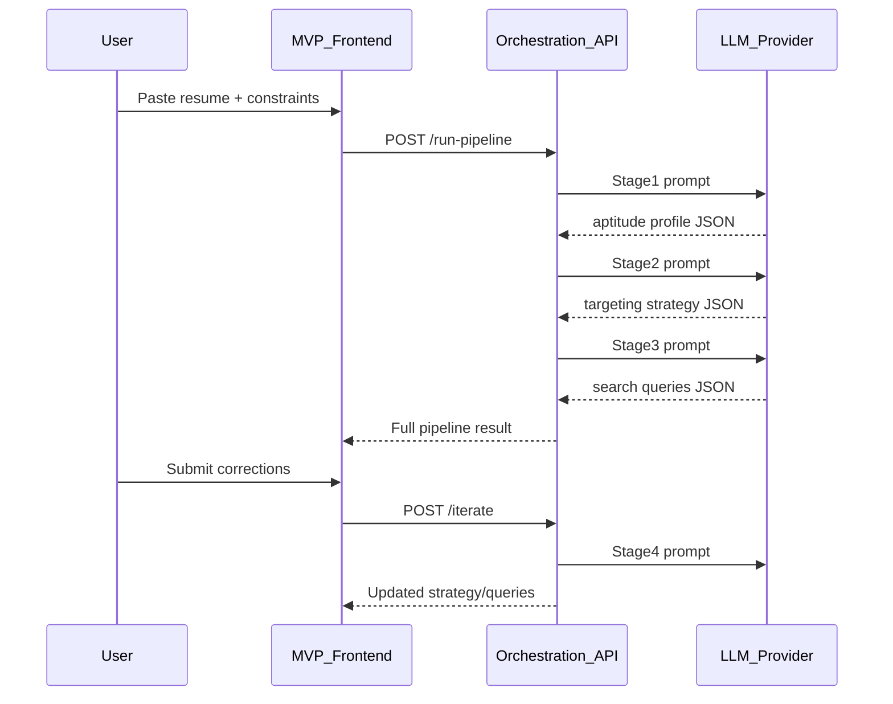

# Aptitude Search — Build Plan

## Plan authority

**This file is the authoritative plan** for aptitude-search. It lives at:

`.cursor/plans/aptitude-search-build.plan.md`

- Only plans under **this repo’s** `.cursor/plans/` folder are authoritative.
- Plan files elsewhere (e.g. `~/.cursor/plans/`) are **never** authoritative for this project.
- When updating the plan, edit this file only. Policy: [.cursor/rules/plan-authority.mdc](../rules/plan-authority.mdc).

---

**Strategy:** Follow the hybrid path in [design-docs/01-first-concept-discussion.md](../../design-docs/01-first-concept-discussion.md): validate with a **prompt workflow pack** first, then build **API + MVP frontend**. Architecture and schemas are designed once in Phase 1 so Phase 2 is mostly orchestration, not re-invention.

**Core thesis to preserve** ([design-docs/03-core-thesis.md](../../design-docs/03-core-thesis.md)): career inference *before* search — aptitude, environment fit, and company-type targeting, not keyword-matching alone.



---

## Phase 1 — Prompt Workflow Pack (current focus)

### 1.1 Repository layout

Create a minimal, pack-friendly structure (no app runtime yet):

```
prompts/
  01-resume-to-aptitude-profile.md
  02-aptitude-to-targeting-strategy.md
  03-targeting-to-search-queries.md
  04-iteration-refinement.md
schemas/
  aptitude-profile.schema.json
  targeting-strategy.schema.json
  search-queries.schema.json
fixtures/
  sample-resumes/          # 2–3 anonymized test resumes
  example-outputs/         # golden outputs after prompts stabilize
docs/
  WORKFLOW.md              # buyer-facing: step-by-step usage
  PROMPT-CONTRACT.md       # internal: ROLE/OBJECTIVE/INPUT/OUTPUT/RULES
design-docs/               # existing; keep as source of truth
```

Update [README.md](../../README.md) with a short pointer to `docs/WORKFLOW.md` and Phase 1 status.

### 1.2 Shared prompt contract

Every prompt file follows the contract from [design-docs/02-initial-concept-documentation.md](../../design-docs/02-initial-concept-documentation.md):

| Section           | Purpose                                                    |
| ----------------- | ---------------------------------------------------------- |
| **ROLE**          | Stage identity (profiler / strategist / query optimizer)   |
| **OBJECTIVE**     | Single transformation performed                            |
| **INPUT FORMAT**  | Paste block or JSON schema reference                       |
| **OUTPUT FORMAT** | Strict JSON matching stage schema                          |
| **RULES**         | No preamble; evidence vs inference; downstream-safe fields |

Cross-cutting requirements (all stages):

- **Explainability:** each output includes brief `rationale` arrays (not chain-of-thought dumps).
- **Confidence signaling:** `confidence: high|medium|low` on inferred fields; cite `evidence_from_resume` where possible.
- **Company/environment fit:** Stage 2 must output `company_types`, `environment_fit`, and `avoid` — not only job titles (per core thesis).

### 1.3 Stage schemas (define before writing prompts)

Formalize JSON schemas so Prompt 2 can consume Prompt 1 output without manual cleanup. Suggested top-level shapes:

**`aptitude-profile.schema.json`** (Stage 1 output)

- `core_skills`, `secondary_skills`, `domains`, `strengths`, `adjacent_roles`, `seniority_band`, `working_style_signals`
- `aptitude_summary` (2–3 sentences)
- `confidence_map` + `rationale`

**`targeting-strategy.schema.json`** (Stage 2 output)

- `primary_roles`, `adjacent_roles`, `roles_to_avoid`
- `company_types`, `environment_fit`, `industries_to_explore`, `industries_to_avoid`
- `keyword_clusters`, `seniority_bands`
- `constraints_applied` (location, remote, salary if user provided)
- `rationale` + per-item confidence

**`search-queries.schema.json`** (Stage 3 output)

- `boolean_queries[]`, `linkedin_queries[]`, `indeed_queries[]`
- `search_variants[]` (labeled: broad / balanced / narrow)
- `recommended_next_actions[]`
- `rationale`

Optional user constraints object (passed into Stage 2/3):

```json
{
  "location": "",
  "remote_preference": "remote|hybrid|onsite|any",
  "salary_min": null,
  "industries_include": [],
  "industries_exclude": []
}
```

### 1.4 Prompt pack contents (from [design-docs/01-first-concept-discussion.md](../../design-docs/01-first-concept-discussion.md))

| #   | Prompt                    | Input                                 | Output                      |
| --- | ------------------------- | ------------------------------------- | --------------------------- |
| 1   | Resume → aptitude profile | Raw resume text                       | `aptitude-profile` JSON     |
| 2   | Aptitude → job strategy   | Stage 1 JSON (+ optional constraints) | `targeting-strategy` JSON   |
| 3   | Strategy → search queries | Stage 2 JSON                          | `search-queries` JSON       |
| 4   | Iteration loop (optional) | Prior stage JSON + user corrections   | Regenerated downstream JSON |

**Prompt 4** handles the differentiation called out in design docs: user corrects strengths/preferences → regenerate strategy and/or queries only (not full pipeline unless requested).

Each `.md` file contains:

1. Copy-paste **system** block (for Custom GPT / project instructions) or **user** template with `{{placeholders}}`
2. One **filled example** using a fixture resume
3. Link to its schema file

### 1.5 Prompt development and testing loop

1. Draft Prompt 1 against 2–3 fixture resumes (include at least one “non-obvious” profile — career changer or mixed stack per thesis example in doc 03).
2. Run Prompt 1 output manually into Prompt 2, then 3 — fix schema mismatches immediately.
3. Maintain a **manual test checklist** in `docs/TESTING.md`:
   - Valid JSON parses against schema
   - Stage 2 references Stage 1 fields (no hallucinated skills absent from profile)
   - Stage 3 queries reflect `keyword_clusters` and `company_types`
   - Rationale present and readable
   - Iteration prompt correctly patches without full rerun when possible
4. Iterate until **acceptance criteria** (below) pass on all fixtures.

**Target models for v1 testing:** ChatGPT (4o/4.1) and one of Claude 3.5/4 — prompts should be model-agnostic JSON; note any model-specific tweaks in `docs/WORKFLOW.md`.

### 1.6 Pack productization (still no backend)

Deliverables for Gumroad/Lemon Squeezy-style sale ($5–$25 range from doc 01):

- `docs/WORKFLOW.md` — 1-page quick start + 10-minute walkthrough
- `prompts/*.md` — all four prompts
- `schemas/*.json` — for power users / future API
- `fixtures/example-outputs/` — proves the workflow
- Optional: `CHANGELOG.md` for pack version (v1.0.0)

**Positioning copy** (derive from docs): “Translate your resume into targeting strategy and search queries — before you keyword-search.”

### 1.7 Phase 1 exit criteria (gate for Phase 2)

Do not start API work until:

- [ ] All 3 core prompts produce schema-valid JSON on 3+ diverse resumes
- [ ] Human review: targeting feels *useful and non-obvious* vs raw keyword extraction
- [ ] Iteration prompt successfully applies a user correction and improves downstream output
- [ ] Buyer doc is complete enough for a stranger to run the workflow without support

---

## Phase 2 — API + MVP Frontend (after Phase 1 gate)

*Outline only; implement after prompts are stable.*

### 2.1 Why schemas-first pays off

Phase 1 schemas become API request/response contracts. The orchestration layer is thin: validate input → call LLM with stage prompt → validate output → pass to next stage.

### 2.2 Suggested stack (from design docs)

| Layer    | Choice                                  | Rationale                    |
| -------- | --------------------------------------- | ---------------------------- |
| API      | Node (Hono/Express) or Python (FastAPI) | Team preference; either fine |
| LLM      | OpenAI API (initial)                    | BYO key model from doc 01    |
| Frontend | Next.js or Vite + React on Vercel       | Fast MVP                     |
| Auth     | None for v1, or magic link later        | Low friction                 |
| Payments | Stripe Checkout or Lemon Squeezy        | After validation             |



### 2.3 MVP scope (minimal)

- Single-page flow: resume in → staged results out (expandable sections per stage)
- Optional constraints form (location, remote, salary, industries)
- “Refine” panel wired to iteration endpoint
- BYO API key stored client-side only (localStorage) — aligns with [design-docs/01-first-concept-discussion.md](../../design-docs/01-first-concept-discussion.md) cost-control pattern
- Export results as JSON/Markdown

**Explicitly defer:** auth, subscriptions, job board scraping, Chrome extension, analytics dashboards.

### 2.4 API endpoints (sketch)

- `POST /v1/pipeline` — full run (resume + optional constraints)
- `POST /v1/stages/{1|2|3}` — single stage (debugging)
- `POST /v1/iterate` — corrections → partial regen

### 2.5 Phase 2 exit criteria

- [ ] End-to-end run matches manual prompt pack quality on same fixtures
- [ ] Schema validation on all API responses
- [ ] MVP deployable on Vercel with documented env setup

---

## Recommended execution order

1. Schemas + `PROMPT-CONTRACT.md`
2. Prompt 1 → test → Prompt 2 → test → Prompt 3 → test
3. Prompt 4 + iteration tests
4. Fixtures, golden outputs, `WORKFLOW.md`
5. Pack polish + README
6. *(Gate)* Phase 2 API then MVP frontend

---

## Risks and mitigations

| Risk                      | Mitigation                                                          |
| ------------------------- | ------------------------------------------------------------------- |
| Prompts drift from schema | Validate every test run; tighten RULES section                      |
| Outputs feel generic      | Emphasize company-type/environment in Stage 2; use diverse fixtures |
| Pack easy to copy         | Speed to market + iteration loop as moat; API UX comes next         |
| Phase 2 rework            | Lock schemas in Phase 1; version pack as `v1.0.0`                   |

---

## Out of scope (per design docs)

- Resume rewriting / ATS optimization
- Application tracking CRM
- Job board integrations
- Subscription SaaS / multi-agent platform
