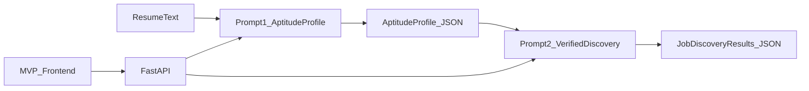

# Aptitude Search — Build Plan

## Plan authority

**This file is the authoritative plan** for aptitude-search. It lives at:

`.cursor/plans/aptitude-search-build.plan.md`

- Only plans under **this repo’s** `.cursor/plans/` folder are authoritative.
- Policy: [.cursor/rules/plan-authority.mdc](../rules/plan-authority.mdc).

---

## Current implementation (as of 2026-05-17)

**Strategy:** Career inference before search ([design-docs/03-core-thesis.md](../../design-docs/03-core-thesis.md)), implemented as a **two-stage** pipeline ending in **verified job postings**, not a separate Boolean/query-generation stage.



### Repository layout (actual)

```
prompts/
  01-resume-to-aptitude-profile.md
  02-verified-job-discovery.md
  XX-original-aptitude-prompt.md    # reference only
schemas/
  aptitude-profile.schema.json
  job-discovery-results.schema.json
  constraints.schema.json
fixtures/
  sample-resumes/                   # 3 resumes
  example-outputs/                  # stage-1 golden only
docs/
  WORKFLOW.md, TESTING.md, PROMPT-CONTRACT.md, PHASE1-GATE.md
backend/                            # FastAPI, port 3001
frontend/                           # Vite + React, port 5173
design-docs/                        # original exploration (historical)
```

### Prompts

| # | File | Input | Output |
|---|------|-------|--------|
| 1 | `01-resume-to-aptitude-profile.md` | Resume text | `aptitude-profile` JSON |
| 2 | `02-verified-job-discovery.md` | Stage 1 JSON + optional constraints | Single `json` block: `job-discovery-results` |

### API (implemented)

| Method | Path | Notes |
|--------|------|-------|
| GET | `/health` | Health check |
| POST | `/v1/pipeline` | Full run |
| POST | `/v1/stages/1` | Aptitude profile only |
| POST | `/v1/stages/2` | Verified matches (JSON; schema-validated) |

Headers: none for API key/model override; key and model are configured server-side via `backend/config.toml`.

**Not implemented:** `POST /v1/iterate`, single-host job-board scraping, auth, payments.

### MVP frontend

- Resume + optional constraints → `POST /api/v1/pipeline` (proxied to backend)
- API key and model in `localStorage`
- Export full result JSON; copy stage-2 text
- No refine/iterate panel

### Validation

- API validates stage 1, stage 2, and constraints via `jsonschema`
- `backend/scripts/validate_fixtures.py` checks stage-1 golden fixture only
- Stage 2: job search via LLM (API pipeline); optional manual run in Cursor for testing

### Phase 1 gate

See [docs/PHASE1-GATE.md](../../docs/PHASE1-GATE.md). **Passed** for two-stage workflow; API + UI shipped.

---

## Superseded design (archived)

An earlier plan called for four prompts and schemas (`targeting-strategy`, `search-queries`, iteration). That pack was **not** shipped. Files `02-aptitude-to-targeting-strategy.md`, `03-targeting-to-search-queries.md`, `04-iteration-refinement.md`, and related schemas **do not exist** in the repo. See [design-docs/README.md](../../design-docs/README.md) for historical concept docs.

---

## Out of scope (unchanged)

- Resume rewriting / ATS optimization
- Application tracking CRM
- Job board integrations as product features
- Subscription SaaS / multi-agent platform

---

## Risks and mitigations

| Risk | Mitigation |
|------|------------|
| Stage 2 hallucinated listings | Prompt requires `verification_status: "verified"`; model instructed to search web; spot-check URLs |
| Prompt/docs drift on “API vs Agent search” | Canonical model in `docs/PROMPT-CONTRACT.md` |
| Prompt/schema drift | Validate stage 1 in API; manual checklist in `docs/TESTING.md` |
