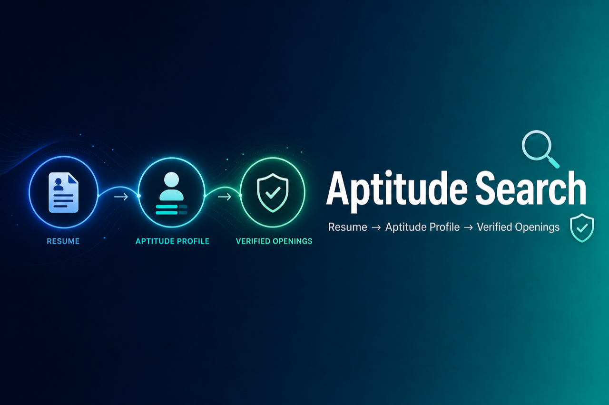

<p align="center">
  
</p>

<p align="center">
  <a href="backend/README.md"></a>
  <a href="backend/README.md"></a>
  <a href="backend/README.md"></a>
  <a href="https://huggingface.co/"></a>
  <a href="frontend/README.md"></a>
  <a href="frontend/README.md"></a>
  <a href="frontend/README.md"></a>
  <a href="schemas/"></a>
  <a href="LICENSE"></a>
</p>

# aptitude-search

Aptitude-driven **opportunity discovery**: resume → aptitude profile → **verified openings only**.

Keyword-based job search does a poor job of connecting people with roles that fit their actual capabilities. This project infers aptitude from a resume, then discovers and verifies openings aligned to that profile—not just keyword overlap.

## Product workflow

**Opportunity discovery** in three LLM stages — **[Stage 1](prompts/01-resume-to-aptitude-profile.md)** (profile) → **[Stage 2](prompts/02-role-family-plan.md)** (role families) → **Stage 3** ([discovery + fit ranking](docs/PROMPT-CONTRACT.md) + [synthesis](prompts/03-job-discovery-synthesis.md))

Steps: **[prompts/README.md](prompts/README.md)**

## Quick start

1. Set up and run the API — [backend/README.md](backend/README.md) (`uvicorn` on port **3001**).
2. Open **Swagger UI:** [http://localhost:3001/docs](http://localhost:3001/docs).
3. Call **`POST /v1/pipeline`** — use the pre-filled example request body, or paste from [`fixtures/pipeline-request-example.json`](fixtures/pipeline-request-example.json).

Example body (resume + Toronto remote SaaS/FinTech constraints):

```json
{
  "resume": "Product-minded software engineer with 7 years of experience building web applications. Strong in TypeScript, React, Node.js, and PostgreSQL. Built customer-facing SaaS features, improved performance, and partnered with design and product teams. Comfortable owning projects end-to-end, mentoring teammates, and working in agile environments.",
  "constraints": {
    "location": "Toronto, ON",
    "remote_preference": "remote",
    "salary_min": 110000,
    "industries_include": ["SaaS", "FinTech"],
    "industries_exclude": ["Gambling"]
  }
}
```

Or from the repo root (with the API running):

```bash
curl -s -X POST http://localhost:3001/v1/pipeline \
  -H "Content-Type: application/json" \
  -d @fixtures/pipeline-request-example.json
```

Response: `aptitude_profile`, `role_family_plan`, and `verified_matches` (discovered opportunities). See **[docs/PROMPT-CONTRACT.md](docs/PROMPT-CONTRACT.md)** for the pipeline.

## Repository layout

```
prompts/          # 01 profile, 02 role families, 03 synthesis
schemas/          # aptitude-profile, role-family-plan, job-discovery-results, constraints
fixtures/         # sample resumes, pipeline-request-example.json, stage-1 golden output
docs/             # WORKFLOW, TESTING, PROMPT-CONTRACT
backend/          # FastAPI — pipeline stages 1–3
frontend/         # MVP UI (Vite + React)
```

## API + UI (optional)

- **[backend/README.md](backend/README.md)** — `POST /v1/pipeline`, server-configured Hugging Face key
- **[frontend/README.md](frontend/README.md)** — local dev on port 5173

## Changelog

**[docs/changelog/README.md](docs/changelog/README.md)** — release index (newest first)

## License

Source code, documentation, prompts, and schemas in this repository are **proprietary**. See [LICENSE](LICENSE). All rights reserved — no use, copying, or distribution without prior written permission.

## Third-party data

<p align="center"><a href="https://services.onetcenter.org/" title="This site incorporates information from O*NET Web Services. Click to learn more."></a></p>

The O\*NET 30.3 database files are **not included in this repository**. Download them locally — see [data/download/README.md](data/download/README.md) — and extract to `data/download/db_30_3_mysql/`. Those files are licensed under [Creative Commons Attribution 4.0 International (CC BY 4.0)](https://www.onetcenter.org/license_db.html) by the U.S. Department of Labor, Employment and Training Administration (USDOL/ETA). O\*NET® is a trademark of USDOL/ETA. This project incorporates information from [O\*NET Web Services](https://services.onetcenter.org/).
